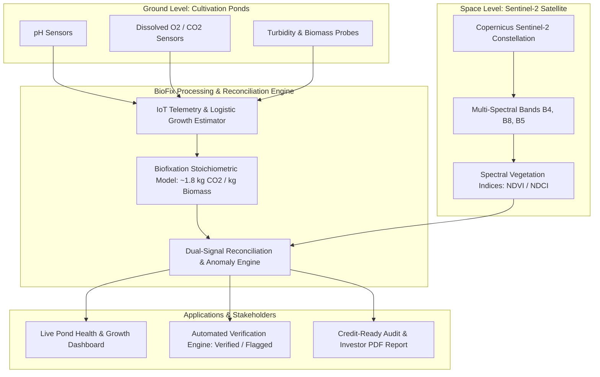

# 🌿 BioFix — Algae-Based Carbon Sequestration Monitoring Platform

> **Verifiable, data-backed monitoring of algae-based carbon capture through dual-source IoT and satellite remote-sensing reconciliation.**

[](https://github.com/Vraj-Ramavat/Pixel_Error_Hackout2026)
[](#)
[](#)
[](#)
[](LICENSE)

---

## 👥 Team Information

**Team Name:** `Pixel Error`  
**Institution:** Adani University  
**Track:** Circular Carbon Ecosystem  
**Event:** HackOut 2026  

### 🚀 Team Members
* **Vraj Ramavat**
* **Heli Gupta**
* **Palak Maithia**
* **Keya Gor**

---

## 📌 Executive Summary

Algae cultivation is one of nature’s most potent carbon capture solutions, capturing carbon dioxide significantly faster than terrestrial plants while yielding valuable feedstocks for biofuels, bioplastics, and bio-nutrients. However, the commercial carbon credit market currently suffers from a massive **trust gap**:

* Manual water sampling is slow, labor-intensive, and non-continuous.
* On-site IoT sensors alone can drift, fail, or be miscalibrated/tampered with.
* Carbon-credit verifiers and green investors lack an independent, real-time mechanism to audit claimed sequestration figures.

**BioFix** bridges this gap by introducing a **Dual-Signal Cross-Verification Engine**. By coupling high-frequency on-site IoT sensor telemetry with publicly accessible, multi-spectral satellite imagery (Sentinel-2 NDVI / NDCI), BioFix reconciles physical readings with orbital remote sensing into a tamper-resistant, auditable carbon sequestration metric.

---

## 💡 Key Problem Statement

```
[ Farm Sensors Only ]  ──> Easy to miscalibrate, drift, or misreport
[ Satellite Only ]     ──> Lower temporal resolution & weather occlusion
-------------------------------------------------------------------------
Result: High verification costs, delayed credit issuance, and investor skepticism.
```

1. **Lack of Continuous Verification:** Carbon credit verifiers typically audit months after sequestration has occurred.
2. **Data Asymmetry & Trust Gap:** Buyers and registries must take farm-reported numbers at face value without ground-truth validation.
3. **Measurement, Reporting, and Verification (MRV) Overhead:** Existing MRV frameworks are expensive and complex for small-to-midscale open-pond and photobioreactor facilities.

---

## 🛠️ The BioFix Solution & Architecture



### 🔬 Scientific Foundation: Biofixation Model

The platform converts verified dry algae biomass growth into exact sequestered $\text{CO}_2$ using scientific biofixation stoichiometry:

$$\text{Biomass Composition} \approx 50\% \text{ Carbon (by dry weight)}$$

$$\text{Molecular Weight Ratio} = \frac{\text{MW}_{\text{CO}_2}}{\text{MW}_{\text{C}}} = \frac{44.01}{12.011} \approx 3.664$$

$$\text{CO}_2 \text{ Sequestered per kg Biomass} = 0.50 \times 3.664 \approx \mathbf{1.832\text{ kg CO}_2 \text{ / kg dry biomass}}$$

### 🛰️ Remote-Sensing Ground Truth

Sentinel-2 multispectral surface reflectance bands are captured and processed over the pond coordinates:
* **NDVI (Normalized Difference Vegetation Index):**
  $$\text{NDVI} = \frac{\text{NIR} - \text{Red}}{\text{NIR} + \text{Red}} = \frac{B8 - B4}{B8 + B4}$$
* **NDCI (Normalized Difference Chlorophyll Index):**
  $$\text{NDCI} = \frac{\text{RedEdge1} - \text{Red}}{\text{RedEdge1} + \text{Red}} = \frac{B5 - B4}{B5 + B4}$$

The platform continuously aligns time-series sensor trends with periodic orbital chlorophyll readings over rolling windows. If both curves match within dynamic statistical confidence bands, the carbon capture batch receives an automated **"Verified"** cryptographic certification status.

---

## ✨ Key Features

* 📊 **Real-Time Operations Dashboard:** Live visibility into pond water quality parameters (pH, DO, dissolved $\text{CO}_2$, temperature, and biomass concentration).
* 📈 **Dual-Trend Growth & Carbon Curves:** Interactive time-series visualizer showing sensor-derived biomass vs. satellite-derived vegetation indices side by side.
* 🤖 **Automated Verification Engine:** Smart reconciliation rules that flag sensor drift, calibration anomalies, or sudden optical inconsistencies for immediate review.
* 📑 **Investor & Verifier Export:** Instant generation of standardized carbon sequestration reports formatted for registry submission (Verra / Gold Standard MRV alignment).
* 🌐 **Multi-Site & Multi-Species Scalability:** Adaptable to multiple cultivation ponds, raceway systems, photobioreactors, and distinct microalgae strains (*Chlorella vulgaris*, *Spirulina platensis*, etc.).

---

## 💻 Tech Stack

| Layer | Technologies & Tools | Purpose |
| :--- | :--- | :--- |
| **Telemetry & Simulation** | Python, NumPy, Pandas, SciPy | Logistic growth simulation, diurnal light & temperature modeling |
| **Remote Sensing** | Sentinel-2 (Copernicus / Sentinel Hub / ArcGIS API) | Multispectral satellite imagery retrieval, NDVI/NDCI computation |
| **Backend API** | FastAPI (Python) / Node.js (Express) | Biofixation algorithms, reconciliation engine, RESTful services |
| **Database** | PostgreSQL / SQLite, SQLAlchemy | Time-series sensor logs, orbital indices, site metadata, audit history |
| **Frontend UI** | React.js, Tailwind CSS, Recharts / D3.js, Lucide Icons | Interactive telemetry dashboard, satellite map overlays, trend charts |
| **Deployment** | Vercel, Render / Railway, Docker | Scalable cloud hosting and CI/CD pipelines |

---

## ⏱️ 36-Hour Hackathon Roadmap

```
[0h - 2h]   🚀 Setup & Architecture: Team role distribution, screen wireframes, repo scaffolding.
[2h - 8h]   🧪 Data Pipeline & Models: Growth simulator, diurnal modulation, Sentinel-2 pipeline.
[8h - 18h]  ⚙️ Core Engine: Biofixation stoichiometric calculator, discrepancy & reconciliation engine.
[18h - 26h] 🖥️ Frontend Dashboard: Real-time charts, satellite index overlay, verification badges.
[26h - 30h] 📄 Reporting & Verification: Credit-readiness export engine, UI/UX polish.
[30h - 34h] 🧪 Testing & Deployment: End-to-end telemetry validation, cloud hosting deployment.
[34h - 36h] 🏆 Pitch & Presentation: Demo walkthrough, investor pitch deck completion.
```

---

## 🌍 Impact & Market Value

1. **Verifiable Carbon Credits:** Eliminates greenwashing by replacing self-reported estimates with dual-validated data.
2. **Accelerated Financing:** Provides climate investors with auditable operational metrics, de-risking capital allocation into algae bio-refineries.
3. **Scalable MRV:** Lowers the cost and time of measurement, reporting, and verification for circular bio-economy ventures worldwide.

---

## 🚀 Getting Started

### Prerequisites
* Python 3.10+
* Node.js 18+ and npm / yarn
* Git

### Local Setup

1. **Clone the repository:**
   ```bash
   git clone https://github.com/Vraj-Ramavat/Pixel_Error_Hackout2026.git
   cd Pixel_Error_Hackout2026
   ```

2. **Backend Setup:**
   ```bash
   cd backend
   python -m venv venv
   # On Windows:
   .\venv\Scripts\activate
   # On Linux/macOS:
   source venv/bin/activate
   pip install -r requirements.txt
   uvicorn main:app --reload
   ```

3. **Frontend Setup:**
   ```bash
   cd ../frontend
   npm install
   npm run dev
   ```

4. **Access the application:**
   Open [http://localhost:3000](http://localhost:3000) in your browser.

---

## 📄 License

This project is licensed under the MIT License — see the [LICENSE](LICENSE) file for details.

---

<div align="center">
  <sub>Developed with 💚 by <b>Team Pixel Error</b> for <b>HackOut 2026</b></sub>
</div>
